

  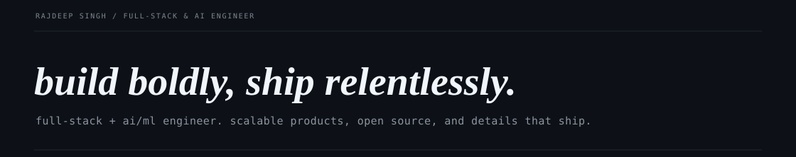

  <a href="https://rajdeep-singh.vercel.app/">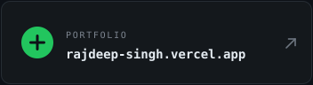</a>&nbsp;
  <a href="https://www.linkedin.com/in/rajdeep-singh-b658a833a/">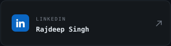</a>&nbsp;
  <a href="https://x.com/rajdeepstwt">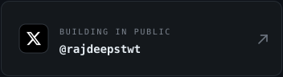</a>

  <a href="https://medium.com/@rajdeep01">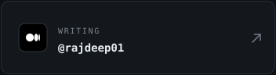</a>&nbsp;
  <a href="https://discord.com/users/993454036751745125">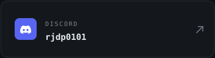</a>&nbsp;
  <a href="mailto:rajdeepsingh10789@gmail.com">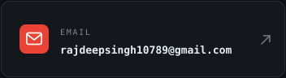</a>

  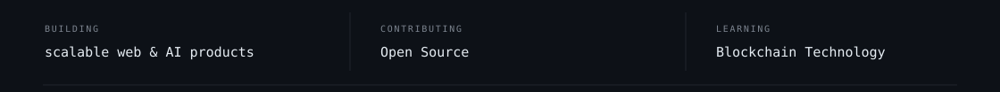

  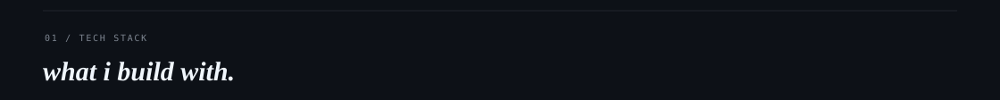

  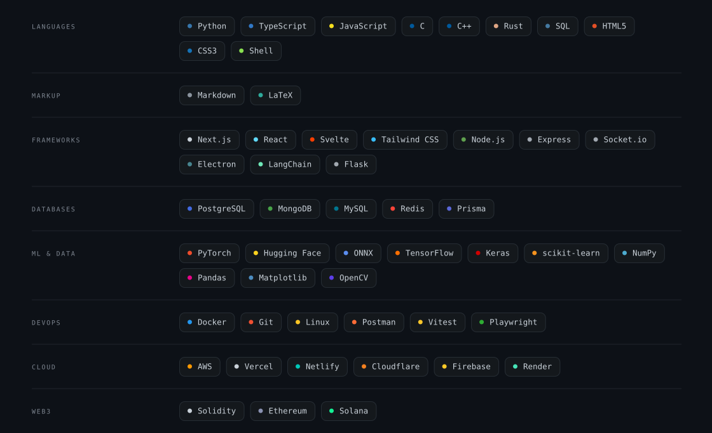

  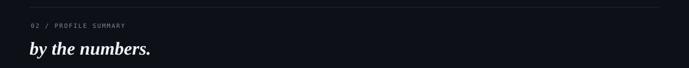

  

